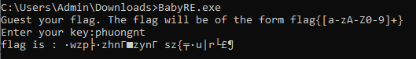
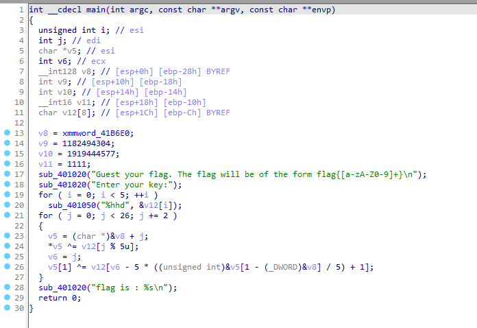
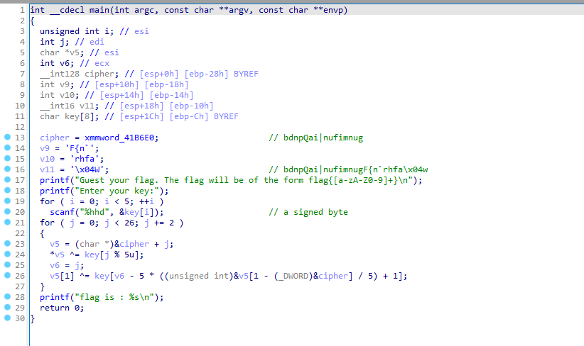
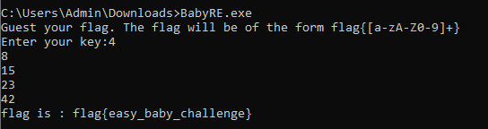

# BabyRE writeup
## Description
Chạy thử chương trình, yêu cầu nhập mật khẩu => flag



## Analysis with IDA
Ném vào ida để phân tích chương trình



Từ Pseudocode ta thấy hàm sub_401020 và hàm sub_401050 là hàm printf và scanf. Biến v8, v9, v10, v11 lưu 1 chuỗi ký tự. Key nhập vào lưu ở v12. Vòng for thứ nhất cho thấy key nhập vào gồm 5 số, kiểu char 1 byte. Vòng for thứ 2 sử dụng chuỗi ký tự cipher ở trên cùng key để tính toán gen ra flag.



Phần tính toán có thể viết lại như sau:
```codetype
v5 = &cipherFlag[j]
*v5 = key[j%5]
v5[1] = key[j - 5*((j+1)/5) + 1]
```
Vì flag có format flag{ nên từ đó lần lượt sẽ tìm được các key:
```codetype
j = 0
	v5 = &cipherFlag[0]
	*v5 ^= key[0]
	v5[1] ^= key[1]
01100010  //"b"
01100110  //"f"
XOR
00000100 => key[0] = 4

01100100  //"d"
01101100  //"l"
XOR
00001000 => key[1] = 8
j = 2
	v5 = &cipherFlag[2]
	*v5 ^= key[2]
	v5[1] ^= key[3]
01101110  //"n"
01100001  //"a"
XOR
00001111 => key[2] = 15

01110000  //"p"
01100111  //"g"
XOR
00010111 => key[3] = 23

j = 4 
	v5 = &cipherFlag[4]
	*v5 ^= key[4]
	v5[1] ^= key[5]
01010001  //"Q"
01111011  //"{"
XOR
00101010 => key[4] = 42
```
Hoặc script:
```
ciperFlag = "bdnpQai|nufimnug"
key = "flag{"
flag = []

for j in range(len(key)):
    flag.append(str(ord(ciperFlag[j])^ord(key[j])))
    
print(flag)
```

```codetype
Flag: flag{easy_baby_challenge}
```
