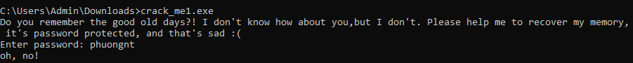
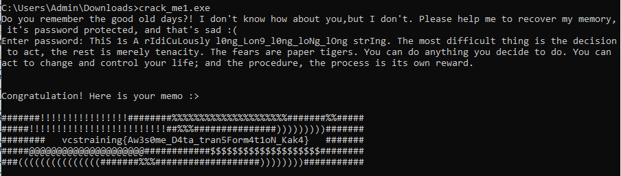

# Crack_me1 writeup
## Description
Chạy thử chương trình, yêu cầu nhập mật khẩu => flag



## Analysis with IDA
Ném vào ida để phân tích chương trình
```
  passwd = 0;
  memset(v9, 0, sizeof(v9));
  v12 = 335;
  memset(v10, 0, sizeof(v10));
  strcpy(
    Format,
    "Do you remember the good old days?! I don't know how about you,but I don't. Please help me to recover my memory, it'"
    "s password protected, and that's sad :(\n");
  v11 = &unk_5E4BE8;
  printf(Format, v4);
  printf("Enter password: ", v5);
  scanf("%300[^\n]s", (char)&passwd);
  v20 = &passwd;
  v16 = v9;
  v20 += strlen(v20);
  v15 = ++v20 - v9;
  v17 = v20 - v9;
  v19 = &passwd;
  v14 = v9;
  v19 += strlen(v19);
  v13 = ++v19 - v9;
  if ( (unsigned int)(v19 - v9) >= 294 )
  {
    if ( check(&passwd) )
    {
      v18 = v17 / 3;
      for ( i = 0; i < v17; ++i )
        v10[i % v18] ^= v9[i - 1];
      for ( i = 0; i < v12; ++i )
        byte_5E4020[i] ^= v10[i % v18];
      printf("\n\nCongratulation! Here is your memo :> \n\n", v6);
      printf("%s", (char)byte_5E4020);
    }
    else
    {
      printf("\nInvalid password\n", v6);
    }
    getchar();
    getchar();
    return 0;
  }
  else
  {
    printf("oh, no!", v6);
    return 0;
  }
```

Nhận thấy chương trình yêu cầu nhập mật khẩu có độ dài >= 294. Sau đó sẽ gọi đến hàm ``` check ``` để kiểm tra mật khẩu nhập vào có đúng hay không. Rồi từ mật khẩu tính toán để gen ra flag.

Check main:
```
  v3 = &unk_5E4BE8;
  if ( (int)strlen(a1) < 55 )
    return 0;
  for ( i = 0; i < 122; ++i )
  {
    if ( !(unsigned __int8)check2(*v3, &a1[v3[1]], v3 + 2) )
      return 0;
    v3 += 3;
  }
  return 1;
```
Check2 main:
```
  v8 = 221;
  v5 = (LPVOID)sub_5E1000((int)&unk_5E4288, 0xDDu, 5);
  v7 = 278;
  v6 = (LPVOID)sub_5E1000((int)&unk_5E4170, 0x116u, 6);
  if ( !v5 || !v6 )
    return 0;
  switch ( a1 )
  {
    case 1:
      dwSize = 97;
      lpAddress = (LPVOID)sub_5E1000((int)&unk_5E4B80, 0x61u, 1);
      break;
    case 2:
      dwSize = 142;
      lpAddress = (LPVOID)sub_5E1000((int)&unk_5E4AF0, 0x8Eu, 2);
      break;
    case 3:
      dwSize = 1685;
      lpAddress = (LPVOID)sub_5E1000((int)&unk_5E4458, 0x695u, 3);
      break;
    case 4:
      dwSize = 235;
      lpAddress = (LPVOID)sub_5E1000((int)&unk_5E4368, 0xEBu, 4);
      break;
    default:
      return 0;
  }
  if ( !lpAddress )
    return 0;
  v11 = ((int (__cdecl *)(int, int, char *))lpAddress)(a2, a3, v4);
  VirtualFree(lpAddress, dwSize, 0x8000u);
  VirtualFree(v5, v8, 0x8000u);
  VirtualFree(v6, v7, 0x8000u);
  return v11;
 ```
 ### Func1
 ```
 bool __cdecl sub_810000(char *a1, unsigned __int8 *a2)
{
  char v2; // cl

  v2 = *a1 % 2;
  if ( !v2 && (*a1 ^ 0x20) == *a2 )
    return 1;
  return v2 == 1 && (*a1 ^ 0x52) == *a2;
}
```
### Func2
```
bool __cdecl sub_9D0000(char *a1, unsigned __int16 *a2)
{
  int i; // [esp+0h] [ebp-Ch]
  unsigned __int16 v4; // [esp+8h] [ebp-4h]

  v4 = a1[1] | (unsigned __int16)(*a1 << 8);
  for ( i = 1; i <= 5; ++i )
    v4 = (((int)v4 >> (16 - i)) | (v4 << i)) ^ 0x1693;
  return *a2 == v4;
}
```
### Func3
```
bool __cdecl sub_6D0000(char *a1, unsigned __int8 *a2)
{
  char v3[68]; // [esp+0h] [ebp-64h] BYREF
  int v4; // [esp+44h] [ebp-20h]
  int v5; // [esp+48h] [ebp-1Ch]
  int v7; // [esp+50h] [ebp-14h]
  int i; // [esp+54h] [ebp-10h]
  int v9; // [esp+58h] [ebp-Ch]
  unsigned __int8 v10; // [esp+5Ch] [ebp-8h]
  unsigned __int8 v11; // [esp+5Dh] [ebp-7h]
  unsigned __int8 v12; // [esp+5Eh] [ebp-6h]
  char v13; // [esp+5Fh] [ebp-5h]
  char v14; // [esp+60h] [ebp-4h]
  char v15; // [esp+61h] [ebp-3h]
  char v16; // [esp+62h] [ebp-2h]

  v9 = 0;
  i = 0;
  v7 = 3;
  v5 = 0;
  v4 = 0;
  qmemcpy(v3, "ABDCEHGFIJKLUNOPYRTSMVWXQZajcdefohibkmlngpqrstuv4xzy8123w56709+0", 64);
  while ( v7-- )
  {
    *(&v14 + v9++) = *a1++;
    if ( v9 == 3 )
    {
      v10 = (v14 & 0xFC) >> 2;
      if ( v3[v10] != *a2 )
        return 0;
      v11 = ((v15 & 0xF0) >> 4) + 16 * (v14 & 3);
      if ( v3[v11] != a2[1] )
        return 0;
      v12 = ((v16 & 0xC0) >> 6) + 4 * (v15 & 0xF);
      if ( v3[v12] != a2[2] )
        return 0;
      v13 = v16 & 0x3F;
      if ( v3[v16 & 0x3F] != a2[3] )
        return 0;
      v9 = 0;
    }
  }
  if ( v9 <= 0 )
    return 1;
  for ( i = v9; i < 3; ++i )
    *(&v14 + i) = 0;
  v10 = (v14 & 0xFC) >> 2;
  if ( v3[v10] != *a2 )
    return 0;
  v11 = ((v15 & 0xF0) >> 4) + 16 * (v14 & 3);
  if ( v3[v11] != a2[1] )
    return 0;
  v12 = ((v16 & 0xC0) >> 6) + 4 * (v15 & 0xF);
  if ( v3[v12] != a2[2] )
    return 0;
  v13 = v16 & 0x3F;
  return v3[v16 & 0x3F] == a2[3];
}
```
### Func4
```
int __cdecl sub_810000(char *a1, int a2, int a3)
{
  char v4[256]; // [esp+0h] [ebp-11Ch] BYREF
  int (__cdecl *v5)(char *, char *, int); // [esp+100h] [ebp-1Ch]
  void (__cdecl *v6)(char *, char *); // [esp+104h] [ebp-18h]
  char v7[8]; // [esp+108h] [ebp-14h] BYREF
  char v8[11]; // [esp+110h] [ebp-Ch] BYREF

  strcpy(v8, "susan");
  v6 = *(void (__cdecl **)(char *, char *))(a3 + 4);
  v5 = *(int (__cdecl **)(char *, char *, int))(a3 + 8);
  v6(v8, v4);
  v7[0] = *a1;
  v7[1] = a1[1];
  v7[2] = a1[2];
  v7[3] = a1[3];
  v7[4] = 0;
  return v5(v4, v7, a2);
}
```
### Flag

```
Flag: vcstraining{Aw3s0me_D4ta_tran5Form4t1oN_Kak4}
```
